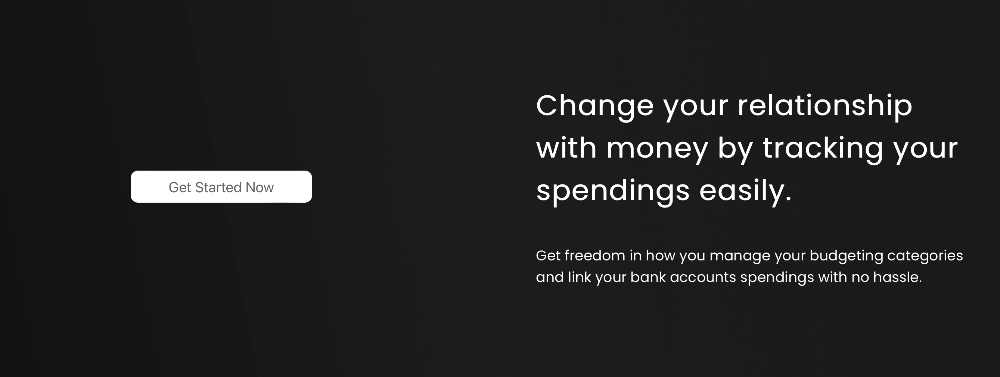
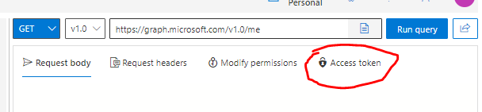
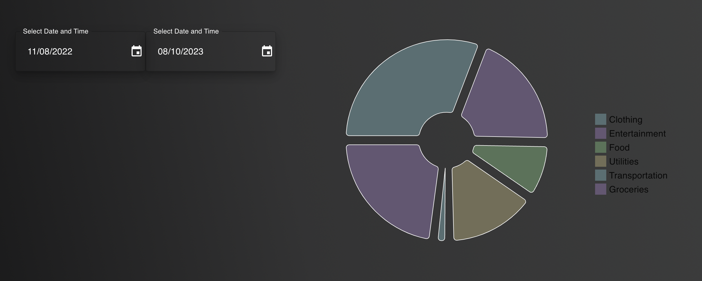
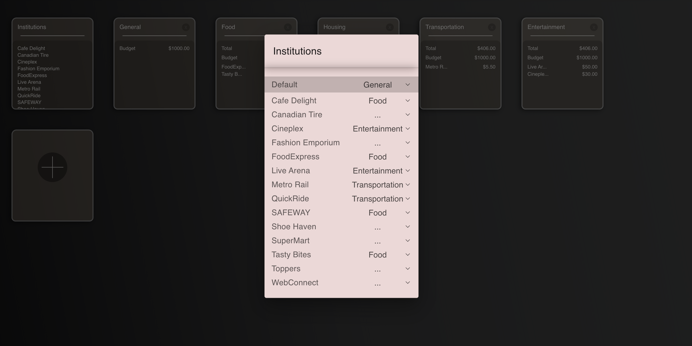

# Budget App - Track Your Expenses

## Project Description
This application is able to track spending and other information from any bank account. When the user swipes a card at a store within 3 seconds the information is added to the app. All banks offer a notification feature where the user inputs an e-mail address in the main bank app, all expenses are sent from the bank to the provided e-mail address, the Budget app then scans the received e-mail for information such as ammount spent and store where the purchase was conducted. These e-mail notifications coming from the bank do not contain any user information, making it a secure way of sharing user's spending information with the budget app to make it easier for the user to track and manage their spending.



## Built With

- PostGreSQL - Database
- Express.js - Back-End
- React - Front-End

## Getting Started

### Installation

1. Clone the repo on your local machine

In your local machine terminal, cd into the folder you would like to clone the repo into and run:

```
git clone https://github.com/DanOlinski/Budget
```

2. Install the required NPM packages.

You will have to install NPM packages for the front-end and back-end server.
First cd into the budget-website folder and run:

```
npm install
```

Then cd into the database folder and run the same command as above.

3. Setup database

Follow the instructions from the README.md file located in the database folder.

4. Run servers to get started.

From your terminal go to the database folder and run the command `npm run local`

Both the front-end and back-end servers have to be run simultaneously.
Open two terminals for that effect. Note that the database server needs to start before the front end react server.

From a second terminal go to the budget-website folder and run the command `npm start`

DISCLAIMER: This application is a proof of concept and has a specific use-case for displaying data.
This website is designed to retrieve data from a single email account. To display fictitious banking data, which mimics real banking email notifications.
Be mindful that the incoming mock data for this presentation will always be the same.
In order to display data from other email accounts, the app would have to be slightly adjusted to handle this

Follow the steps below to proceed with the expected use-case scenario.

### Use-Case Scenario

1. On the home page, click 'Get Started Now'. This will bring you to the sign up page.

2. On the sign up page, input your email and password then click 'Sign Up'.

3. Once the account is created, you will be re-directed to the main dashboard page. No bank accounts are linked yet, so no data is displayed.

4. Click the 'Add a New Account' button. A form will be displayed, prompting you to input a bank name and a unique token. 

- Enter the bank name of your choice.

- To retrieve a token:
  - For this app we are using outlook e-mail service. The next upgrade for this application (comming soon) is to host it's own e-mail service, so that when a new user is created it will automatically generate an email address for the new user. That e-mail address should then be placed in your bank app in order to send spending notifications to the Budget app.
  - The instructions below describe how to connect to the banking spending data that is already inside an outlook e-mail account. 
  - head to Graph Explorer: https://developer.microsoft.com/en-us/graph/graph-explorer 
  - login with the following credentials;
    - Email: `final.project.lhl@outlook.com`
    - Password: `#Finalprojectlhl`
    - If you are prompted with a request for a verification code on sign in, contact Daniel Olinski G. at +1(403)6180269

  - On the Graph Explorer page (link above), click the button 'Access Token' to generate a unique token, which provides API access to the email and creates the connection between the application and the bank notifications (these notifications are currently in the outlook email account).
  

- Copy the token, go back to the budget app form, paste the token then click 'Submit'.

5. You now have your first account set up, but there doesn't seem to be any data.. To import the data, you will have to make a download emails request by clicking on the 'Import Budget Details' button. A form will be displayed, which asks you to input the Access Token again. The same token described in the step above can be used here.

6. Upon completion of the request, make sure you are in the dashboard page, there you will see two date menus, these two dates mark the boundaries you want to set, to view spending data (transactions that ocurred within the provided time frame)

- The application obtains access to the account's emails and will scan each email for relevant banking information. This includes account balance, transactions, the institution where the transaction was made, the amount spent and the credit/debit card number used.

- The bank account information will display the last recorded account balance and the debit/credit cards linked to the account.

- The pie chart will display the total spending for the selected time frame, which is initially set between the first of the month and the current day of the month. The dates can be adjusted to display the spending within any time frame you like, as long as there is a data recorded for the selected time frame.
  - when you set a store to a category the pie chart will split into sections (each section represents a category) (check the description below (section 7) for more info on how to set up categories)




7. Click on 'Manage' button in the navigation bar to see your spending details and manage your spending categories. The spending displayed are the transactions recorded during the time frame selected in the dashboard.

- The application has three categories set up when first logging in: General, Food and Transportation. All the spendings will initially be set to the default category General.

- The institutions box lists the different stores recorded on the banking transactions. By clicking on the box, a form opens up, which lets you set a store, to an existing category. This means that every time you make a purchase from that specific store, the purchase will be displayed in the category you selected for that store. Ex: Choose to put SAFEWAY purchases in the category Food.
- Any store that is not set to a category will be displayed in the default category.



- Once a store is assigned to a category, all transactions will be displayed in it. To view the spending details for a given category, simply click on the desired category. This will give you an overview of the spendings tracked and the total amount spent. It also displays the maximum budget assigned to it. You can update the budget limit as you wish by changing the input field and clicking 'Save.

- If a category has exceeded the budget limit, its color will change to red.

- To add a category, click on the + button. It will ask you to input the category name and budget limit. Click 'Save' to add it to your tracked categories. Categories can also be deleted (except for the set default category)


## Credits

This application has been built by Daniel Olinski Guterres and Eliza Galea.


